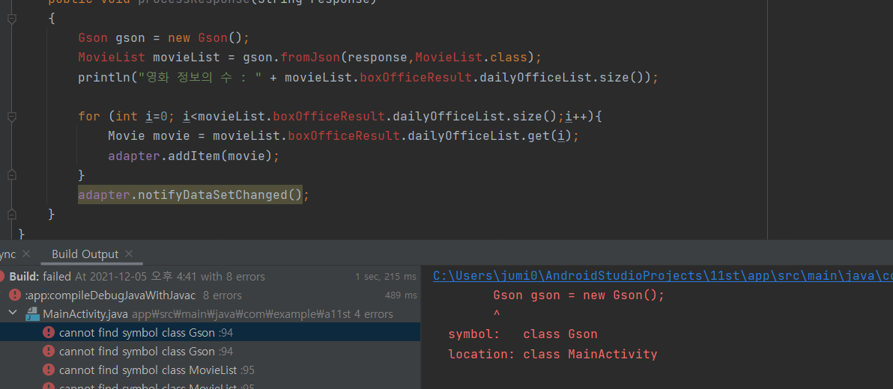

20273024 김주미

## 2주차과제
</img>

## 3주차과제
</img>
</img>

## 4주차과제

할 일 리스트를 적어두고 일정 시간 내에 완료하지 않으면 알림이 뜨는 어플
리스트를 작성해둘 수 있는 어플은 많지만 써두기만하고 자각하지 못할 때가 있어서
그 날의 할일을 잊지 않도록 자동 알림 기능이 추가적으로 있으면 좋을 것 같다

## 5주차과제
</img>
</img>

## 6주차과제
</img>
</img>

## 7주차과제
</img>

## 10주차과제
</img>

늦게 제출하더라도 오류를 고치고 내려고 했는데 도저히 어느부분에서 오류가 났는지 모르겠습니다...

## 11주차과제
</img>

## 12주차과제
</img>

## 13주차과제
</img>
